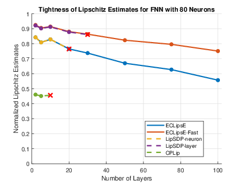
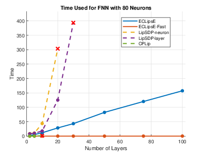
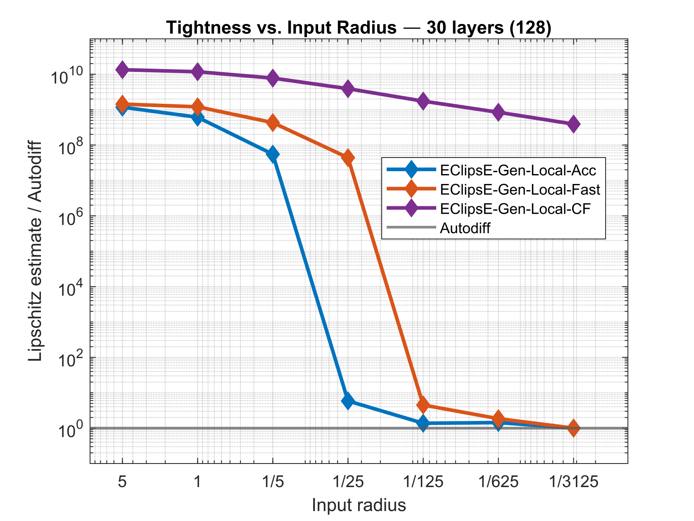

# ECLipsE

**Efficient compositional global and local Lipschitz estimation for deep neural networks**

[](https://pypi.org/project/eclipse-nn/)
[](https://openreview.net/forum?id=61YYSy078Z)
[](https://openreview.net/forum?id=CuqnFjeu5a)
[](LICENSE)

**[Installation](#installation) · [Quick Start](#quick-start) · [MATLAB](#matlab) · [Reproducing the Papers](#reproducing-the-papers)**

ECLipsE is a family of scalable methods for computing certified Lipschitz upper bounds for deep feedforward neural networks. The central idea is to replace a large network-level certification problem with a sequence of smaller layerwise problems, substantially improving scalability with network depth.

**ECLipsE** provides global Lipschitz estimation through the optimization-based **ECLipsE** and the closed-form **ECLipsE-Fast** variants.

> **Yuezhu Xu and S. Sivaranjani, "ECLipsE: Efficient Compositional Lipschitz Constant Estimation for Deep Neural Networks," NeurIPS 2024.**
> [OpenReview](https://openreview.net/forum?id=61YYSy078Z)

<details>
<summary><b>BibTeX</b></summary>

```bibtex
@inproceedings{
xu2024eclipse,
title={ECLipsE: Efficient Compositional Lipschitz Constant Estimation for Deep Neural Networks},
author={Yuezhu Xu and S Sivaranjani},
booktitle={The Thirty-eighth Annual Conference on Neural Information Processing Systems},
year={2024},
url={https://openreview.net/forum?id=61YYSy078Z}
}
```

</details>

**ECLipsE-Gen-Local** extends the compositional framework to local Lipschitz estimation by propagating neuronwise local activation information. It provides the **Acc**, **Fast**, and **CF** variants with different tightness-computation tradeoffs.

> **Yuezhu Xu and S. Sivaranjani, "ECLipsE-Gen-Local: Efficient Compositional Local Lipschitz Estimates for Deep Neural Networks," Transactions on Machine Learning Research, 2026.**
> [OpenReview](https://openreview.net/forum?id=CuqnFjeu5a)

<details>
<summary><b>BibTeX</b></summary>

```bibtex
@article{
xu2026eclipsegenlocal,
title={ECLipsE-Gen-Local: Efficient Compositional Local Lipschitz Estimates for Deep Neural Networks},
author={Yuezhu Xu and S Sivaranjani},
journal={Transactions on Machine Learning Research},
issn={2835-8856},
year={2026},
url={https://openreview.net/forum?id=CuqnFjeu5a}
}
```

</details>

## Highlights

### Scalable global Lipschitz certification

<p align="center">
  
  
</p>

ECLipsE decomposes global certification into layerwise optimization problems, reducing the computational dependence on network depth. **ECLipsE-Fast** further replaces the stage optimization with a closed-form computation, enabling fast certification of deep and wide networks.

### Local information substantially tightens the certificate

<p align="center">
  
</p>

ECLipsE-Gen-Local progressively refines neuronwise activation-slope information over the input region. As the region becomes smaller, the resulting certified local Lipschitz estimates can become substantially tighter and approach the local Jacobian-based value.

## Implementations

For new applications, we recommend using the maintained implementations provided through the Python package and [`Matlab implementation/`](Matlab%20implementation/).

> **Implementation note.** The maintained implementations include additional numerical robustification developed after the original paper implementations, including more careful stage-certificate verification, numerical feasibility checks, and robust fallback handling where applicable. These changes are intended to improve numerical reliability while preserving the underlying ECLipsE and ECLipsE-Gen-Local formulations.

The [`ECLipsE_paper/`](ECLipsE_paper/) and [`ECLipsE_Gen_Local_paper/`](ECLipsE_Gen_Local_paper/) directories are retained for reproducing the corresponding published experiments and should not be interpreted as the recommended maintained implementations.

## Installation

Install the Python package from PyPI:

```bash
pip install eclipse-nn
```

For development from source:

```bash
git clone https://github.com/YuezhuXu/ECLipsE.git
cd ECLipsE
pip install -r requirements.txt
```

## Quick Start

### Python

The unified `LipConstEstimator` interface supports both global ECLipsE and local ECLipsE-Gen-Local estimation.

```python
import torch
import torch.nn as nn
from eclipse_nn import LipConstEstimator

model = nn.Sequential(
    nn.Linear(5, 32),
    nn.ReLU(),
    nn.Linear(32, 32),
    nn.ReLU(),
    nn.Linear(32, 2),
).double()

estimator = LipConstEstimator(model=model)

# Global Lipschitz estimates
L_eclipse = estimator.estimate("ECLipsE")
L_fast = estimator.estimate("ECLipsE_Fast")

print("ECLipsE:", L_eclipse)
print("ECLipsE-Fast:", L_fast)

# Local Lipschitz estimate
center = torch.zeros(5)

L_local, time_used, status = estimator.estimate_gen_local(
    center=center,
    epsilon=0.1,
    actv="relu",
    algo="Fast",
)

print("ECLipsE-Gen-Local-Fast:", L_local)
print("Time:", time_used)
print("Status:", status)
```

ECLipsE-Gen-Local supports:

```python
algo="Acc"
algo="Fast"
algo="CF"
```

Additional examples are available under [`demo/`](demo/).

## MATLAB

Numerically robustified, maintained MATLAB implementations are provided under [`Matlab implementation/`](Matlab%20implementation/).

### ECLipsE

```matlab
addpath(fullfile('Matlab implementation', 'ECLipsE'));

[L, time_used, trivial_bound] = ECLipsE(weights);
[L_fast, time_fast, trivial_bound] = ECLipsE_Fast(weights);
```

### ECLipsE-Gen-Local

```matlab
addpath(fullfile('Matlab implementation', 'ECLipsE_Gen_Local'));
addpath(fullfile('Matlab implementation', 'ECLipsE_Gen_Local', 'utils'));

[L, alphas, betas, time_used, status] = ECLipsE_Gen_Local( ...
    weights, biases, 'relu', center, epsilon, 'Fast');
```

The SDP-based MATLAB variants require [CVX](https://cvxr.com/cvx/).

A combined MATLAB example is provided in [`demo/demo_matlab.m`](demo/demo_matlab.m).

## Reproducing the Papers

The paper directories preserve the corresponding experimental implementations and the code required to regenerate their datasets and trained models. Generated data are stored locally under each paper's `datasets/` directory and are not tracked by Git.

For new applications, use the maintained Python or MATLAB implementations above rather than the archived paper implementations.

### ECLipsE — NeurIPS 2024

The original paper implementation and its data-generation code are under [`ECLipsE_paper/`](ECLipsE_paper/).

Generate all random networks used in the paper:

```bash
cd ECLipsE_paper
python generate_random_weights.py
```

Train the MNIST models:

```bash
python training_MNIST.py
```

Or generate all required paper data:

```bash
python generate_all_data.py --all
```

Generated files are placed under:

```text
ECLipsE_paper/datasets/
```

The MATLAB paper experiments can then be reproduced using:

```text
ECLipsE_paper/Lip_estimates.m
```

### ECLipsE-Gen-Local — TMLR 2026

The paper implementation is under [`ECLipsE_Gen_Local_paper/`](ECLipsE_Gen_Local_paper/), with data-generation utilities in [`ECLipsE_Gen_Local_paper/data_generation/`](ECLipsE_Gen_Local_paper/data_generation/).

Generate all random-network configurations:

```bash
cd ECLipsE_Gen_Local_paper/data_generation
python generate_random_ECLipsE_Gen_Local.py
```

Train the baseline and Jacobian-regularized MNIST models:

```bash
python training_mnist_jacreg.py
```

Generate the PGD robustness data:

```bash
python MNIST_attack.py
```

Or generate all required paper data:

```bash
python generate_all_data.py --all
```

Generated files are placed under:

```text
ECLipsE_Gen_Local_paper/datasets/
```

The repository therefore separates the **maintained Python and MATLAB implementations** from the **paper-reproduction code**, while keeping all experimental datasets fully regenerable from source.
